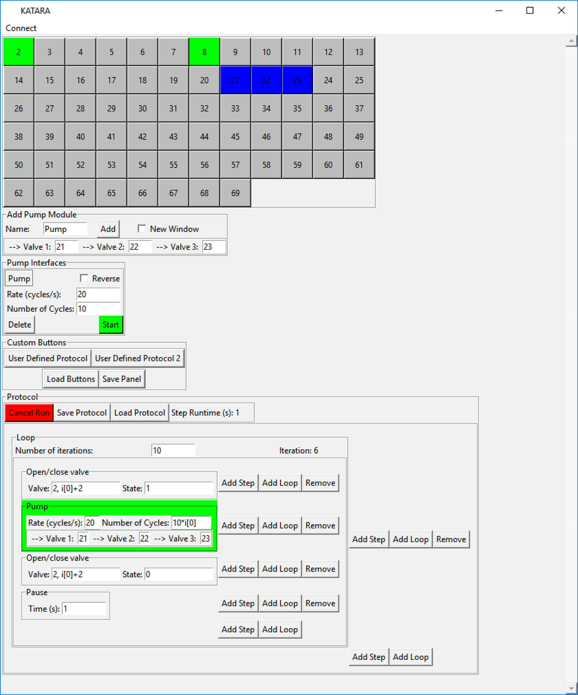

# KATARA

The Kit for Arduino-based Transistor Array Actuation (KATARA) is an open-source and low-cost Arduino-based controller for microfluidic large scale integration. It can drive up to 70 solenoid valves to actuate pneumatic control lines on a device. The KATARA includes a python package with a Graphical User interface (GUI) to control it from a personal computer.

The KATARA GUI allows users to both control valves and peristaltic pumps manually. Users may also use the GUI to write programs involving iterating sequences of valve actuations and peristaltic pumping without any knowledge of a programming language. We also provide a programming interface for those who would like to write python programs to control the KATARA.

See our [paper](https://doi.org/10.1016/j.ohx.2017.10.002) for a full description. The software is available on [Github](https://github.com/streetslab/KATARA-Microfluidics-Controller) and the circuit board design files are available on [EasyEDA](https://easyeda.com/jwhite2/Driver_Shield_for_Arduino_Mega-479918a931264dbdaa817511dac3210f). Please contact us if you have any questions.
