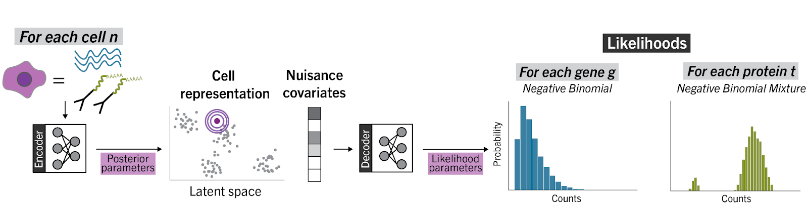

# totalVI

totalVI [^ref1] is a computational method designed for end-to-end analysis of CITE-seq data [^ref2], and developed by Adam Gayoso and Zoë Steier. totalVI relies on neural networks and Bayesian methods to model the observed count data as a composition of biological and technical factors. A major focus of totalVI is to learn a low-dimensional representation of the data that jointly captures both the RNA and protein measurements of a cell, with the goal of enhancing our ability to define cellular identity. This joint representation of the data can be propagated throughout the analysis pipeline, underlying both cell-level tasks like stratification of cells into types and states, as well as feature-level tasks like differential expression of RNA and proteins. Importantly, totalVI also models technical factors in the data, like variation due to sequencing depth, background in the protein data, and batch effects, such that no prior normalization of the data is needed.

totalVI can be applied in a variety of ways, including aiding in construction of large CITE-seq cell reference atlases, identifying discriminative protein panels for future sorting, understanding the relationship between RNA and proteins in single cells, imputation of missing proteins due to mismatched antibody panels, as well as helping optimize antibody panels for experiments. totalVI is available via the [scvi-tools package](https://scvi-tools.org/) , and comes with a user-friendly interface, along with interaction with Scanpy and Seurat. A [tutorial](https://docs.scvi-tools.org/en/stable/) is also available.

## Press

TotalVI: A transformative algorithm, Berkeley Engineering News, https://engineering.berkeley.edu/news/2021/03/totalvi-a-transformative-algorithm/

## References

[^ref1]: Gayoso, A., Steier, Z., Lopez, R., Regier, J., Nazor, K. L., Streets, A., & Yosef, N. (2021). Joint probabilistic modeling of single-cell multi-omic data with totalVI. Nature Methods, 18(3), 272-282.
[^ref2]: Stoeckius, M., Hafemeister, C., Stephenson, W., Houck-Loomis, B., Chattopadhyay, P. K., Swerdlow, H., … & Smibert, P. (2017). Simultaneous epitope and transcriptome measurement in single cells. Nature methods, 14(9), 865-868.
